# Tomato : A online food Delivery Website 

Welcome to our modern Tomato Food Delivery Platform, a powerful web application designed to make ordering food simple, fast, and convenient.

Leveraging modern Web Technologies, our platform allows users to explore menus, browse dishes, add items to the cart, and place orders seamlessly.

---

# Tomato

## User Interface 

  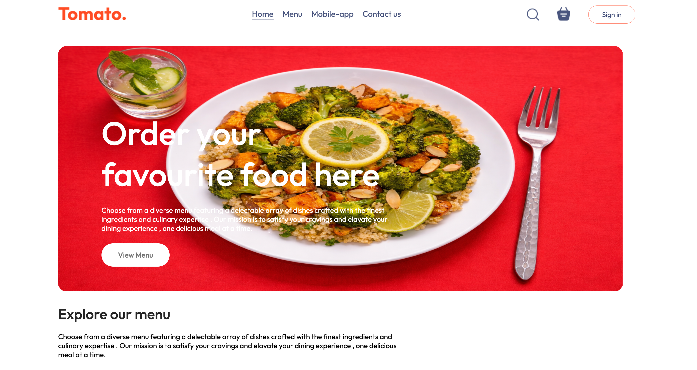

   

The Tomato platform provides a clean and intuitive interface where users can easily explore food items, browse categories, and quickly order their favorite meals.

---

## Explore Menu

  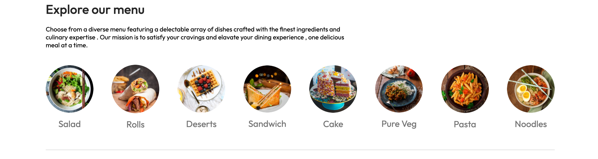

Users can browse different food categories such as Salads, Rolls, Desserts, Sandwiches, Pasta, Noodles, and more.

---

## Food Menu Items

  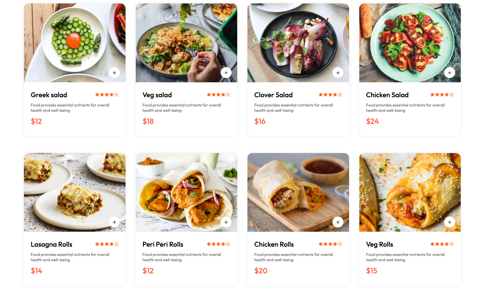

  

  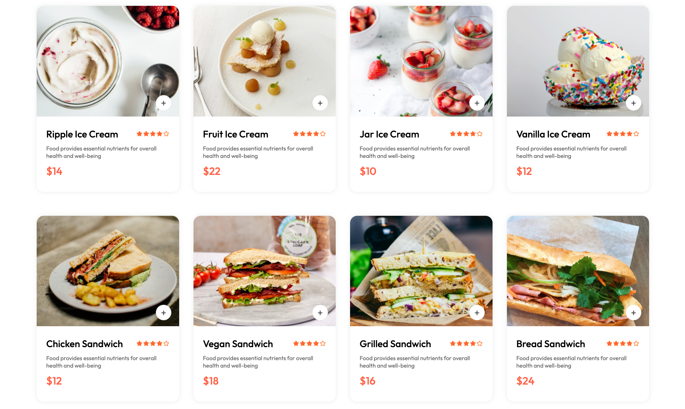

 

  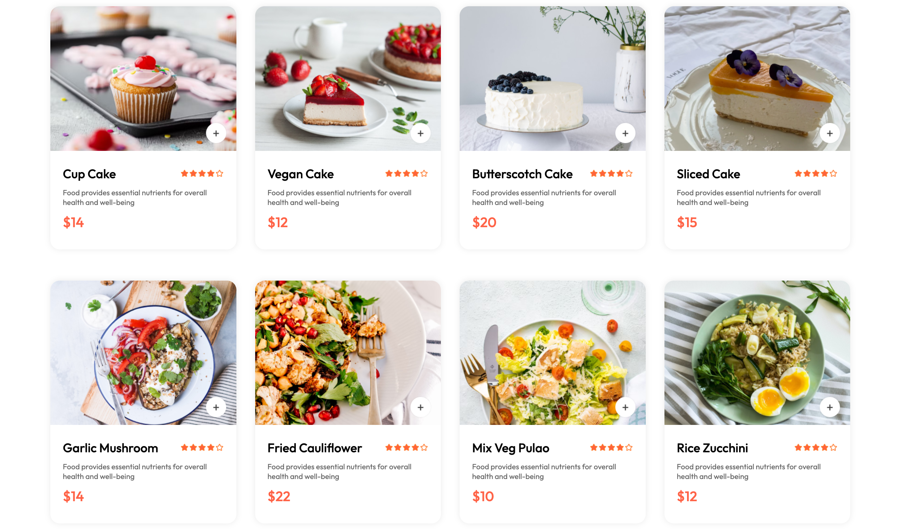

 

  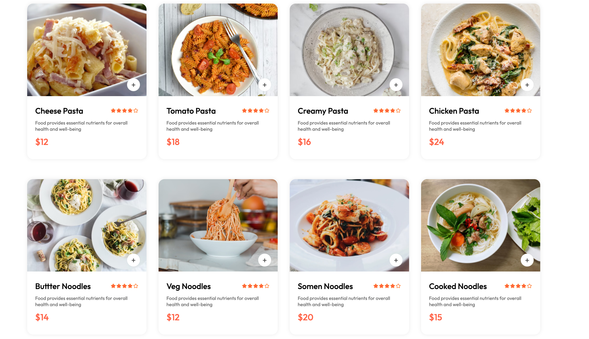

 

The menu section displays a variety of delicious dishes along with images, ratings, descriptions, and prices.
Users can easily add their favorite food items to the cart.

---

## User Authentication

### Sign Up

  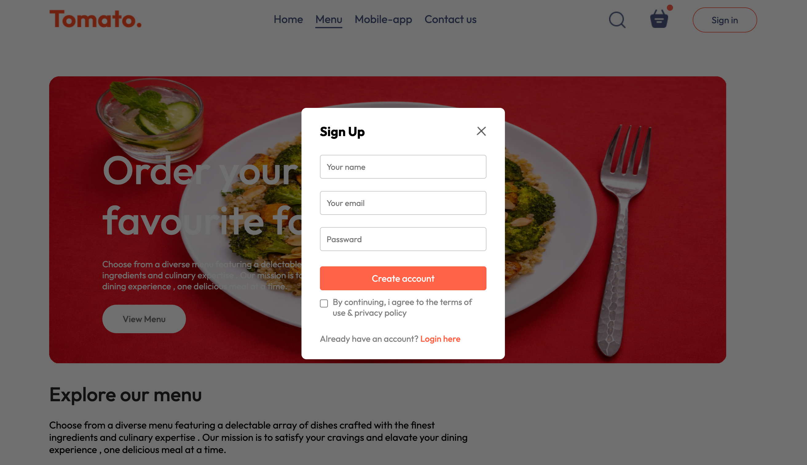

   

Users can create a new account to start ordering food and manage their orders.

--- 

### Login (already exist user)

  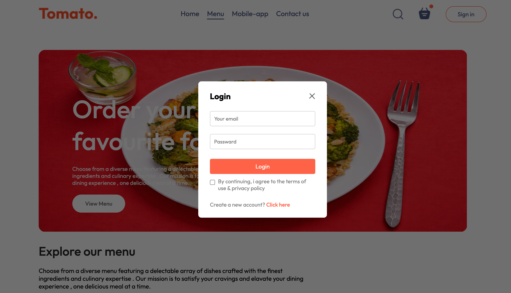

   

Existing users can log in securely using their email and password.

--- 

## Cart System

  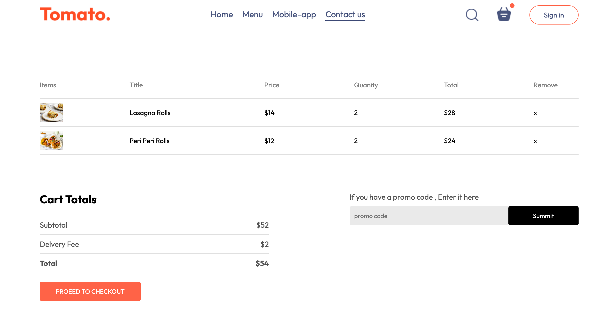

   

The cart system allows users to review their selected items, update quantities, and proceed to checkout.

--- 

## Delivery Information & Checkout

  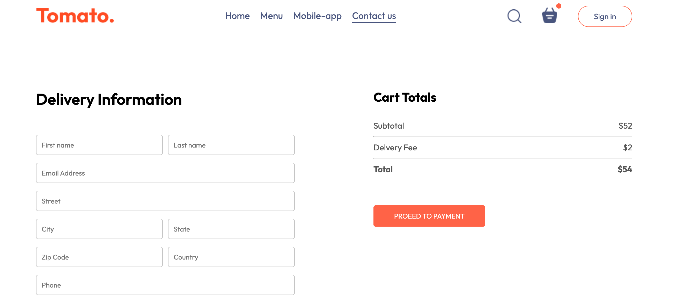

   

Users enter delivery details such as name, address, city, phone number, and payment details to complete the order.

---

## Mobile App Download and Footer

  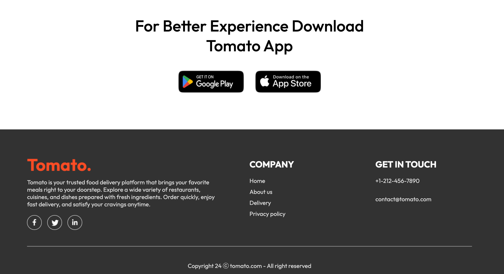

   

Users can download the Tomato mobile application from Google Play Store or Apple App Store for a better ordering experience.

---

## Key Features

### User-Friendly Interface
The platform offers a simple and intuitive interface that allows users to easily explore menus and place orders.

### Wide Variety of Food Options
Users can browse multiple categories of food items including salads, rolls, desserts, sandwiches, pasta, and noodles.

### Cart Management
Users can add, remove, and update items in their cart before placing an order

### Secure User Authentication
The system includes login and registration functionality to manage user accounts securely.

### Order & Delivery System
Users can provide delivery details and complete their order quickly.

### Responsive Web Design
The website is fully responsive and works smoothly on desktop, tablet, and mobile devices.

---

## System Workflow

1. System Workflow
2. User visits the website
3. User explores food categories and menu items
4. User adds food items to the cart
5. User signs up or logs in to their account
6. User reviews the cart and proceeds to checkout
7. User enters delivery information
8. Order is placed successfully

---

## Technologies Used

- React.js
- Node.js
- Express.js
- MongoDB
- HTML / CSS
- JavaScript
- REST API

---

## Project Goal

The goal of **Tomato** Food Delivery Platform is to provide users with a fast, simple, and convenient way to order their favorite meals online.

Our mission is to create a seamless food ordering experience that connects users with delicious food from their favorite restaurants.

## Developer - Ritesh Pandey

---
